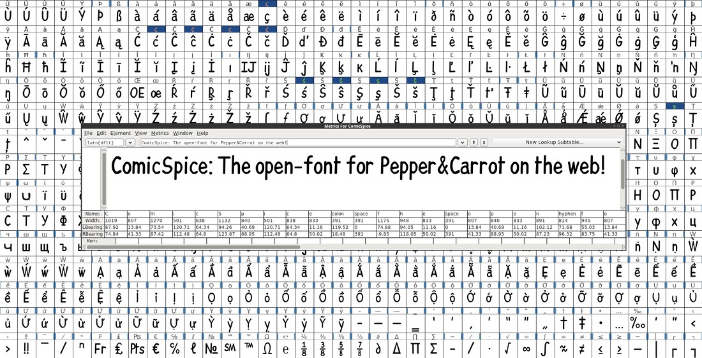
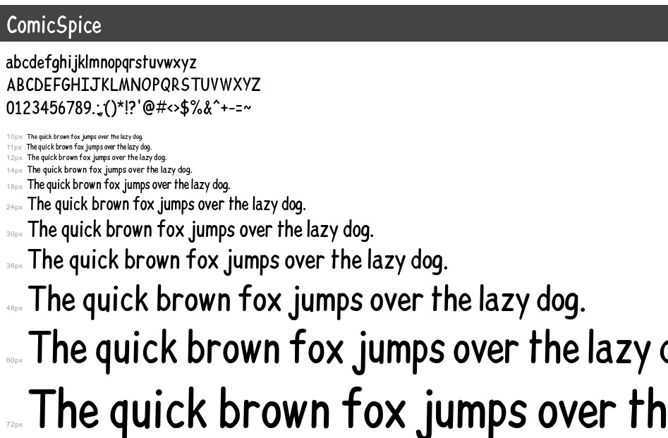

# ComicSpice by Deevad

This is a comic font forked and inspired from "Comic Relief" and "Patrick Hand" The derivation was done by David Revoy (Deevad, info@davidrevoy.com) in Nov,2016, for the webcomic Pepper&Carrot. More information on [this article](http://www.peppercarrot.com/en/article390/my-fight-against-cdn-libraries).

## Demo:

In the folder, a basic HTML and CSS show this demo. For easy copy/pasting.

## Origines and derivatives fonts:

- The mother font of ComicSpice is [Comic Relief](https://fontlibrary.org/en/font/comic-relief) an alternative to ComicSansMs with same metric, copyrighted (c) 2013, Jeff Davis (info@loudifier.com), with Reserved Font Name "Comic Relief" licensed under the SIL Open Font License, Version 1.1. This license is available with a FAQ at: http://scripts.sil.org/OFL . I worked a lot to break the aspect a bit too much ComicSansMs of ComicRelief. My own glyph for A,E,F,S but also a,e,t...etc...

- Some accent/latin-extended glyph from the font [Patrick Hand](https://fonts.google.com/specimen/Patrick+Hand) by (c) Patrick Wagesreiter licensed under the SIL Open Font License, Version 1.1. This license is available with a FAQ at: http://scripts.sil.org/OFL

## License:

licensed under the SIL Open Font License, Version 1.1. This license is available with a FAQ at: http://scripts.sil.org/OFL

## Notes:

The rendered webfonts (woff2, svg, eot) are generated with the webservice http://transfonter.org/ from the ttf.

My workflow: edit Fontforge sfd source file, generate a ttf, send to transfonter.org , receipt rendered fonts, integrate in website.

## Files details:

Why embeding 4 webfont is necessary? Two words: browser compatibilty. 

* TTF/WOF = support in almost all browser after IE9.0

* WOFF2 = smaller size, only recent CHROME and FIREFOX can get it

* SVG = for old chrome or Opera.

and for editing: 

* SFD =  Fontforge source files, for editing
